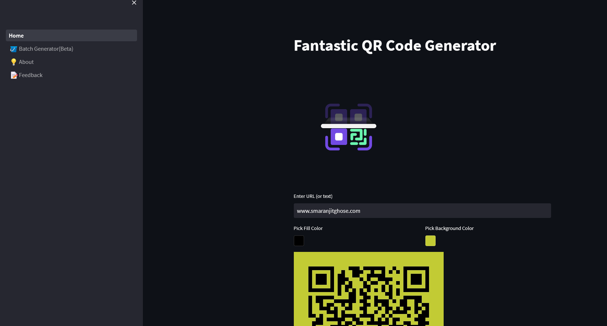

# Fantastic QR Code Generator

<p align = "center"></p>

A minimalistic web application to generate qrcodes built using python 

## Set-Up ⚒️

<p align = "center"></p>

- Ensure you have the latest stable version of [Python](https://www.python.org/downloads/) in your system

- Open your terminal / command prompt. 

- Clone the repository 

    ```
    git clone https://github.com/smaranjitghose/fantasticqrcode
    ```

- Change the directory to the cloned project
    
    ```
    cd fantasticqrcode
    ```

- Install the dependencies

    ```
    pip install -r requirements.txt
    ```

- Load the application

    ```
    streamlit run Home.py
    ```

- If the app does not load by itself in your default browser, open a browser of your choice and navigate to  `http://localhost:8501`

- To stop the application, press `CTRL + C` in your terminal

## Demo 👇

[Click Here 🔗](https://smaranjitghose-fantasticqrcode-home-j7oubv.streamlit.app/)

<p align = "center"></p>


## Future Work 🏗️

- Generate Batch QR Codes using csv file of URLs
- Make an exectuable file
- Dockerize the application


## Note ✏️

<p align = "center"></p>

- For Streamlit Sharing, mentioning versions of the modules in requirements throws error at times 

## Deployment Options 🥊

<p align = "center"></p>

- [Streamlit Cloud](https://streamlit.io/cloud)
- [HuggingFace Spaces](https://huggingface.co/docs/hub/spaces)

- [Fly](https://fly.io/)
- [Railway](https://railway.app/)
- [Render](https://render.com/)
- [Cyclic](https://app.cyclic.sh/#/)

- [Heroku](https://www.heroku.com/)
- [Digital Ocean](https://www.digitalocean.com/)

- Google App Engine
- Amazon EC2 Instance
- Azure App

(**Using Google Colab/Kaggle as temporary MVP server**)

- [pyngrok](https://pyngrok.readthedocs.io/en/latest/index.html)
    - Step 1: Install pyngrok in Google Colab

        ```
        ! pip install pyngrok
        ```
    
    - Step 2: Sign-up in [ngrok](https://ngrok.com/) and get Authentication Token

    - Step 3: Authenticate
        
        ```python
           from pyngrok import ngrok
           ngrok.set_auth_token("xxx")
        ```
    - Step 4: Load the Streamlit App at port 8051, create a tunnel for it and reveal the public URL for the tunnel

        ```python
           !nohup streamlit run app.py --server.port 8051 &
           url = ngrok.connect(8051).public_url
           print(url)
        ```
    
    - Step 5: Share URL with client
     


- [localtunnel](https://github.com/localtunnel/localtunnel)
    - Step 1: Install localtunnel

        ```
        npm install -g localtunnel
        ```
    - Step 2

        ```
        streamlit run Home.py & npx localtunnel --port 8501
        ```
    
    - Step 3: Share URL with client

## Acknowledgements 🙏

<p align = "center"></p>

- **Animations**: [LottieFiles](https://lottiefiles.com)